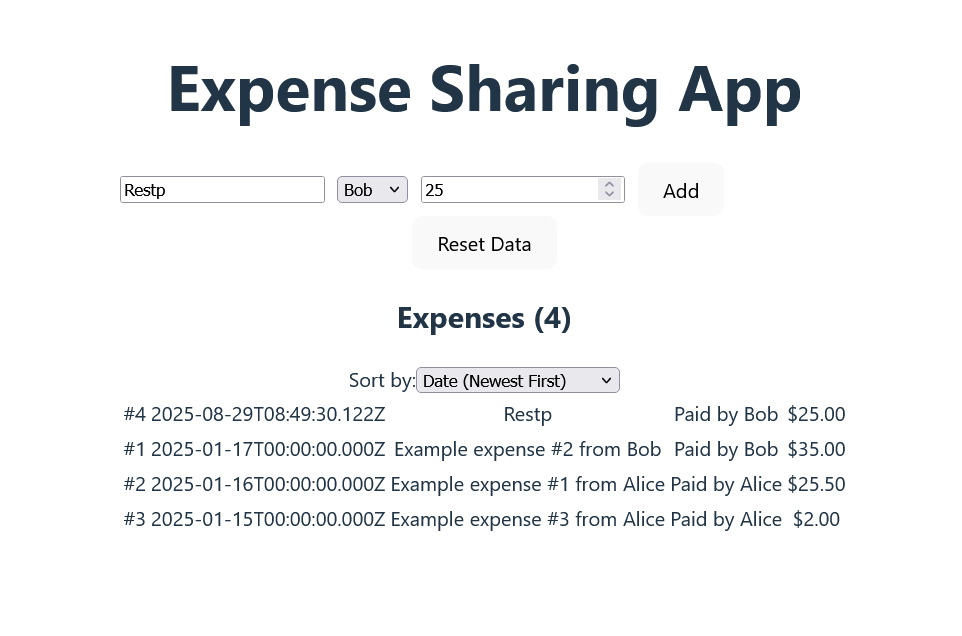
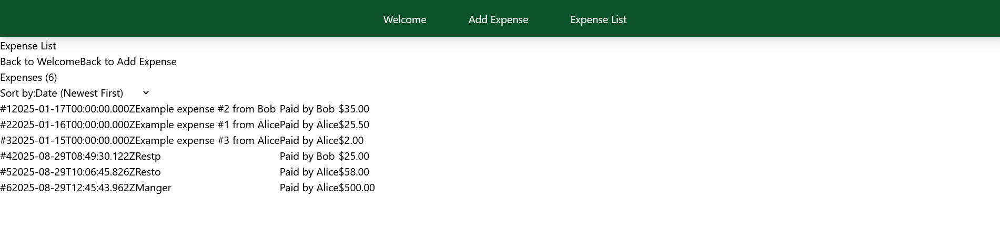

## Introduction

We've done a good job last week to get all parts of a modern application working - front end, API and database - we even deployed it.

Now let's be honest, looking at our screen, this looks more like a technical proof of concept than something any real users may want to use - let alone may pay for:



Our goal this week is to transform this into something that's _usable_. That means a lot of work on the front end.

> From the trenches: User Experience (UX) is critical. Website design has improved a lot the last 10 years, especially in the B2C area. Users expect clean interfaces with clear actions and fast feedback. Not delivering those will hurt any business - well, [almost](https://brussels.craigslist.org/).

Don't forget to commit regularly & to push on render - an application that's not deployed is not generating any value.

## Setup

- Get [last week's solution](https://github.com/e-vinci/web3-2025/tree/main/exercises/lesson-2-deploy-and-persistence) as a starting point for this exercise. You can also work from your own code (assuming you got it working), but you may need to adapt a bit the instructions.

## Recommended Reading

- [React Router (Official Docs)](https://reactrouter.com/)
- [Working with Browser history (MDN)](https://developer.mozilla.org/en-US/docs/Web/API/Window/history)
- [Tailwind concepts (Official Docs)](https://tailwindcss.com/docs/styling-with-utility-classes)
- [Shad CN (Official Docs)](https://ui.shadcn.com/)

## Exercises

### 1. Split the app

As a first step we're going to split our current `Home` page into three separated ones:

- `Welcome` will show an introduction text to our app
- `List` will show the list of expenses
- `Add` will show the form to add a new expense.

As a first step, create all three pages as separated file with a simple text output allowing to see if we're on the proper page. Leave the content in `Home` for now.

In order to be able to navigate, we're going to create a `currentPage` state in the `App`:

```tsx
const [currentPage, setCurrentPage] = useState<string>('Welcome');
```

We're going to use that value to be able to show the proper page:

```tsx
if(currentPage == "Welcome") {
    return <Welcome setCurrentPage={setCurrentPage}/>
}
...
```

We need to pass the prop in order to be able to update the current page from our component. We're using tsx, so make sure to type your props properly.

In the `Welcome` page, add two buttons to navigate to `List` and `Add`:

```tsx
<button onClick={ setCurrentPage("Add")}>View Expense List/>
```

> **&#10067; Would it not be better to use something like React Router for this?** Indeed - and we're going to. But doing some things manually can help understand how the librairies are working so it's a good step. We alway may not always want to add a full library for a simple task we can do in a few lines of code.

Check that you are able to navigate from Welcome to your other pages. Add a "back" button on those going back to `Welcome` when clicked.

### 2. Better routing with context, history and a small JavaScript object

This works but has several flaws:

- We'll need to pass `setCurrent` page manually to any new page
- The if/else code in `App` is ugly
- The url is not changing when we move from page to page

Let's solve this.

When we have data that is useful to a lot of components, passing by props become a hassle - especially if you need to pass those props deep down into components.

React default mechanism to solve this is a Context - a piece of data that is set somewhere high in the component hierarchy and can then be used anywhere "below" it.

Let's create our PageContext in the App.tsx file but _outside_ of the `App` function:

```jsx
export const PageContext = createContext<{
    currentPage: string;
    setCurrentPage: (page: string) => void;
}>()
```

Our context will contain two values - a currentPage as a string and a setCurrentPage as a function taking a string in and returning nothing.

We can now return our different pages wrapped in the context:

```tsx
if (currentPage == 'Welcome') {
  return (
    <PageContext.Provider value={{ currentPage, setCurrentPage: handlePageChange }}>
      <Welcome />
    </PageContext.Provider>
  );
}
// if ...
```

With this done we can remove the "setCurrentPage" props from our pages - instead we'll get this via the context:

```jsx
export default function Welcome() {
  const { setCurrentPage } = useContext(PageContext);
  return (
    <>
      Welcome to the Expense Tracker
      <button onClick={() => setCurrentPage('List')}>View Expenses</button>
      <button onClick={() => setCurrentPage('Add')}>Add Expense</button>
    </>
  );
}
```

This is a very common technique in react to share a common state in many components. Don't overuse it, but it's generally the logical step once you start having too many drill down props.

Let's refactor our big `App` `if` now - we have three pages and we want to go to the one whose name fits the currentPage value. This looks like an "associative array" is something like a Java Map - or in JavaScript a simple object:

```jsx
const pages: { [key: string]: React.FunctionComponent } = {
  "Welcome": Welcome,
  "List": List,
  "Add": Add
}
```

With this we can replace our if part with:

```jsx
const CurrentPageComponent = pages[currentPage];

return (
  <PageContext.Provider value={{ currentPage, setCurrentPage: handlePageChange }}>
    <CurrentPageComponent />
  </PageContext.Provider>
);
```

Some explanations are needed here - how can this work?

First of all, jsx component are just JavaScript functions ie:

<Welcome />

is the same as calling the `Welcome()` function.

Second, JavaScript functions are values like any other - they can be assigned to variables or as we do here set into an object.

To finish our half backed implementation of React Router, we should update the url when we change page - there is a JavaScript api for that on the window.history object:

```js
window.history.replaceState(null, page, `/${page.toLowerCase()}`);
```

Question is - where to put that code? We want to update the url each time we change page, which means in the setCurrentPage function - but that's not possible as that function is generated by the useState hook.

Let's create a new function `handlePageChange`

```js
  function handlePageChange(page: string) {
    window.history.replaceState(null, page, `/${page.toLowerCase()}`);
    setCurrentPage(page);
  }
```

That were the context Provider helps - we now have a single place where we give the "setCurrentPage" function to all our pages - as the handlePageChange function has the same signature (it takes a string as argument and return nothing), we can simply switch it:

```jsx
<PageContext.Provider value={{ currentPage, setCurrentPage: handlePageChange }}>
  <CurrentPageComponent />
</PageContext.Provider>
```

In other words - we give the handlePageChange function as the value for the setCurrentPage property in the context.

This is a common pattern in React too - wrapping useState based method with additional behavior.

Check that everything is still working, commit and deploy your code - congratulation, you've implemented a basic routing feature using standard React capabilities.

When you'll be using React Router (or another routing library), remember that while it's much more advanced that what we did here, it uses the same mechanisms.

You can see the related code in React Router [here](https://github.com/remix-run/react-router/blob/main/packages/react-router/lib/context.ts#L112)

### 3. Best routing with a library

> From the trenches: Libraries are there for what is called "cross concerns" - features that every application need to implement but that are not differenciator - think login, permissions, state management, etc. The goal is to recover a maximum amount of time to work on your main features - your user is not going to pick your app because it has a better login system (except if you are bulding Okta but that's quite niche).

Note that React Router is only one of the available options there (another is TanStack Router) and that routing libraries can work in many different ways (try to look at the Framework, Data and Declarative mode in the React Router doc)

Time for a little React Router refresh - install it and replace our hand made version by it using the Data mode.

Move the code from Home to the different pages:

- Expenses table in List
- Form into Add

Replace the buttons by `NavLink` elements, and use `useNavigate` to navigate back to the list when an Expense is properly added to the form. Remove the context and the setCurrentPage prop.

Make sure everything is still working.

Create a new NavBar component with links to Home, List and Add (a priori an horizontal bar on the top with three links - don't worry about the style for now).

Add the NavBar to all three pages.

Time to use one of ReactRouter feature - `Outlet` - it allows you to create a general LayoutPage with common elements (for example the NavBar) and then leave it to children page to put their content in place of the Outlet.

Create a new Layout page that will return the NavBar and an Outlet.
Update the routes to use it, making our main three pages chidren of the Layout one:

```tsx
const router = createBrowserRouter([
  {
    path: "/",
    element: <Layout />,
    children: [
      {
        path: "/",
        element: <Welcome />
      },
      ...
    ]
  },
]);
```

Check that everything is working properly. Note that this changed the way the `List` page works, as the `NavBar` is shown directly, while only the content has the "Loading" message.

### 4. Styling with tailwind

Despite our claims at the start of the session, our application is not much better looking. Time to do some styling.

Styling in React is a hot debate with many options from using CSS as usual, to a series of variants (SCSS, ...) or using styles directly on components.

We're going to use Tailwind (a CSS library) for this course.

Tailwind is a "utility first" CSS library - the idea is that you will use classes to describe what the component looks like, not what it is (which may be the exact contrary of CSS usage advice).

To make this a bit more concrete:

```tsx
// using a button.danger css selector
<button className="danger" />
// Tailwind
<button className="text-white bg-red-600 border border-black" />
```

Tailwind can be divisive for making pretty much one css class per possible style, leading to very long list of styles. The upsides are in something very clear to read as long as you don't have to repeat the classes everywhere - which you should not as we have a reuse method - React's own components.

Install Tailwind on the project (we use the [Vite](https://tailwindcss.com/docs/installation/using-vite) plugin). It can be configured in many way, but we're going to use it "out of the box". Make sure you have the VS code extension too as autocomplete helps _a lot_ with the styling.

Let's style our first components - our NavBar. We want it to:

- Use the full space of the screen (horizontally)
- Use white text on dark green background with a small shadow
- Get the links centered with some space around them

Something like this: 

This uses color properties (`text-` and `bg-`), spacing (`p-` for padding) shadows (`shadow`) and some flex layout to help space the components. Between the docs and some retries, you should get it.

Now we'd like for the current NavLink to be put in bold. You'll need three things for that:

- Know the url - check `useLocation()` for this
- The proper Tailwind class (`font-bold`)
- A way to apply the className conditionnally:

You're not restricted to simple string when putting properties - any JavaScript code is valid, ie this will show the large text if the variable "count" is above 10:

```tsx
<MyComponent className={count > 10 ? 'text-xl' : 'text-sm'} />
```

Time for some more styling:

- Use the Layout to make sure every page runs into a centered div with some margins on both sides (a good base for non mobile use case is to devote 1280px to the main content - text is not easy to read on very long lines)
- Create or generate some welcome text on the home page, make it big and center it. Keep links to both other pages looking like button (note: button normally react to being hovered)
- Make the expense table bigger to help with readability - align all columns to the left, except the amount to the right (why?). Hover on the current line.
- Same with the form - make each element on its own line with proper label alignment and that the add button is more visible

As usual, commit, deploy and test.

### 5. Adding a library

While we can style components quite fast (as we've seen in the previous section) one of the benefits of React's ecosystem is the availability of component libraries - open source package that provide all the standard basic components that an application can need - from simple ones (button, links) to very complex (calendars, accordeons, etc).

Some examples includes Material UI (MUI), Chakra UI, Antd and Shadcn that we are going to use. Most of them allow you to customize the components further or at least to theme them (update the colors, etc).

This goes again with the "common concern" - you're probably not there to reinvent how a button looks like, and making proper component is not easy - a simple button may require a good amount of work:

- Different sizes
- Variant for success, danger or outlines
- Hover reaction
- Enabled/disabled status
- Option for text or icons
- ...

ShadCN is an open source components library recently bought by Vercel. It provide a good set of standard components, and allow further styling using Tailwind which make it a good combination. An usual part of shad is that you don't really install it as a npm package - instead it uses a CLI to copy the components you need into your own repository.

Go install shad using the [Vite option](https://ui.shadcn.com/docs/installation) (we already have Tailwind installed, don't do it twice).

Look at the component list of Shad, and start installing what we need ie:

- Navbar
- Footer
- Table (not the Data Table, the simple one)
- Forms (DatePicker and Inputs)

Go step by step in the application, using Shad component when appropriate.

Put a carousel on the home page, using dummy images from the web.

A good example of a complex component is the [sonner](https://ui.shadcn.com/docs/components/sonner) - a sort of notification. Use it when the user add a new expense - this is a good example of providing feedback to the user for each of their actions.

---

## Optional Challenges

- Under the expense list, show what each person has paid and what is their balance (the amount they owe or need to recover). This will need to make some computation on the React side (we don't want to update the API for this)
- Replace the Table by a DataTable implementing sorting and filtering.
