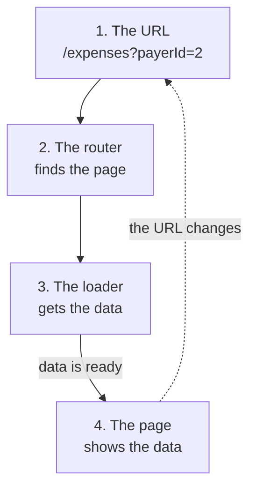
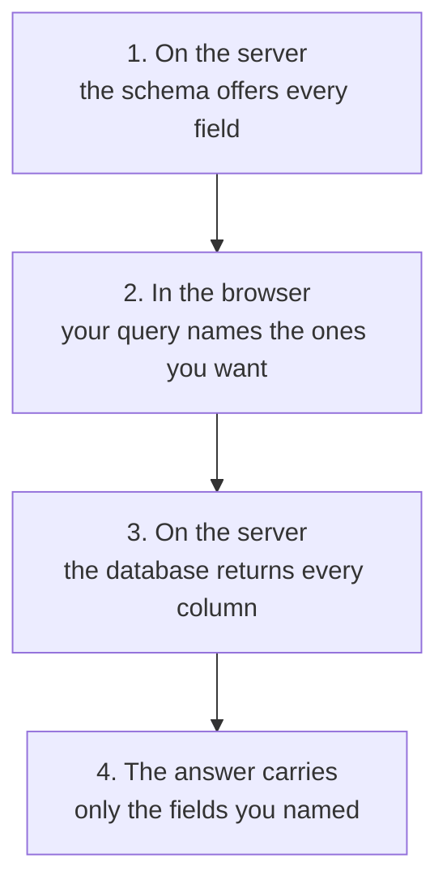

## Course material

- [Presentation Slides](https://raw.githubusercontent.com/e-vinci/web3-2025/refs/heads/main/src/slides/lesson-5-theory.pptx)

## Introduction

Our application works, but it is still **one single page**. Everything — the add form, the search form, the
list — is stacked in `Home.tsx`. You cannot link to a specific expense, you cannot use the browser's back
button, and refreshing always drops you back to the same screen.

This week we fix that in two steps, and the second step only makes sense because of the first.

**Step 1 — React Router.** We split the app into real pages (`/`, `/expenses`, `/expenses/:id`, `/expenses/new`)
and we move data fetching out of `useEffect` and into **route loaders**. A loader is a plain function attached
to a route: React Router calls it *before* rendering the page and hands you the result. This removes a
surprising amount of code, no more `if(loading)` in your component. 

**Step 2 — GraphQL.** Once we have several pages, each page needs a *different shape* of the same data. The
list needs a little. The detail page needs a lot. We will first try to solve this with REST, feel the problem,
and only then introduce GraphQL as the thing that solves it.

> **From the trenches:** this is the honest order in which these tools get adopted in real teams. Nobody wakes
> up wanting GraphQL. They wake up with eleven endpoints that all return *almost* the same object in *almost*
> the same shape, and a mobile team asking for a twelfth.

## Objectives

By the end of this lesson you can:

- **Split a single-page app into addressable pages** with React Router, so every screen has a URL you can
  share, bookmark and reach with the back button.
- **Replace `useEffect` + `useState` + `loading` with a route loader**, and say why the component gets
  simpler.
- **Put a filter in the URL** with `useSearchParams`, and say what re-runs when the URL changes.
- **Explain, using your own app**, why one REST endpoint per resource forces you to choose between
  over-fetching and writing a second endpoint.
- **Expose your existing services through a GraphQL schema**, and write a query returning exactly the fields
  one screen renders — no more, no less.
- **Write a mutation that takes an `input` type**, and reuse the same Zod validation your REST route uses.

If you can do those six things on Friday without looking anything up, the lesson worked. The last two are the
ones that matter most: everything before them exists to make the problem they solve visible.

## If you fall behind

Everything in Part 3 — exercises 4, 5 and 6 — carries the last two objectives, and they are the reason the
lesson exists. So if you are running short, do not trade them away to polish Part 1.

Two things are safe to postpone: **the tidying in 1.5** (deleting `Home.tsx`, `App.tsx` and the unused
components — nothing depends on them being gone) and **the optional challenges**, which sit after the summary
for exactly that reason. One thing is not: **Exercise 3**. It is short, and it is where the problem GraphQL
solves stops being a claim and becomes something you have watched break.

## Recommended Reading

Read the first two before you start. The others are references to come back to during the exercises.

1. [React Router – Data mode routing (Official Docs)](https://reactrouter.com/start/data/routing) – how
   `createBrowserRouter`, nested routes and `Outlet` fit together.
2. [React Router – Data loading (Official Docs)](https://reactrouter.com/start/data/data-loading) – `loader`
   and `useLoaderData`, the replacement for `useEffect` + `useState`.
3. [Full Stack Open – Part 8: GraphQL](https://fullstackopen.com/en/part8) – a second, slower explanation of
   everything in part 2 of this lesson. Read section 8a if GraphQL does not click.
4. [GraphQL – Schemas and Types (Official Docs)](https://graphql.org/learn/schema/) – the type system you will
   write in the SDL.
5. [GraphQL Yoga – Express integration (Official Docs)](https://the-guild.dev/graphql/yoga-server/docs/integrations/integration-with-express)
   – the three lines that mount a GraphQL server on our existing Express app.

## Setup (~15 min)

Start from [last week's solution](https://github.com/e-vinci/web3-2025/tree/main/exercises/lesson-4-form-migration-end),
or from your own code if you got lesson 4 working.

Make sure the backend and the frontend both still run before you change anything. You should be able to list
expenses, filter them, and add one.

### Starting from our solution: reset your database

If you switch to our solution rather than continuing with your own code, its data model will not match the
database you already have. The fastest fix is to throw the database away and build a fresh one.

**Locally**, your PostgreSQL lives in a Docker volume stored in `backend/data/postgres`. Delete the folder and
Docker recreates an empty database:

```bash
# from backend/
docker compose down
rm -rf data/postgres
docker compose up -d
```

Then build the schema and fill it with demo data:

```bash
# from backend/
npx prisma db migrate --advance-ref db # apply the migrations
node scripts/db-populate.ts           # insert demo data
```


**On Render**, delete your PostgreSQL instance and create a new one. Copy its connection string into the backend service's `DATABASE_URL` environment variable and redeploy — the build command is `npm install && npx prisma db migrate`, so the migrations run as part of the deploy and the tables are created for you.
If you want demo data up there too, point `DATABASE_URL` in
your local `.env` at the production database, run `db-populate.ts` once, then put your local string back.

> **&#9888; Deleting the database is the course shortcut here — the migration is not.** Throwing the database
> away is only acceptable because this is a course and the only thing in there is demo data. On a real product
> those rows are someone's money, orders or medical records, and you cannot get them back. What you would do
> instead is write a **migration** that transforms the existing data in place, and that is exactly why the
> solution ships one: `prisma db migrate` is the command you will still be running after you graduate, and
> `prisma db update` — which inspects your database and reshapes it to match the contract, dropping columns if
> that is what it takes — is a prototyping convenience you should leave behind with your student projects.

### What you are starting from

If you start from last week's solution, look at the files in `src/types/`. Each one uses Zod to group
everything about one kind of data: its shape, its validation rules, and the functions that convert a database
row into it.

Today you will add a second way into the application — a GraphQL endpoint next to the REST routes — and you
will reuse those same validation functions without changing them.

### Your demo data

Re-run `node scripts/db-populate.ts` whenever you want a clean slate; it wipes and refills everything in
dependency order, so it is safe to run twice. Two details in that data are deliberate and show up later: one
of the four users has **no bank account**, and one expense has **no category**.

---

# Part 1 – React Router

## Exercise 1: Install the router and create the pages (~30 min)

### 1.1 Install

```bash
# in frontend/
npm install react-router
```

> **&#9888; Read this before you copy a tutorial.** Almost every React Router tutorial, blog post and AI answer
> you will find says `npm install react-router-dom`. **That package is frozen at v7 on npm** — its code was
> merged into `react-router` for v8, and it no longer receives updates. If you install it you will silently get
> an outdated v7 next to your v8 and your imports will not line up. Everything we need this week —
> `createBrowserRouter`, `RouterProvider`,
> `useLoaderData`, `Outlet`, `NavLink`, `useNavigate`, `useSearchParams`, `useParams` — comes from the single
> package `react-router`.

### 1.2 Create the page components

You already have a `src/pages/` folder — it holds `Home.tsx`. Create these four files inside it, each
returning nothing but an `<h1>` for now, so you can see which page you are on:

```
src/pages/
  Welcome.tsx                 /
  expenses/
    ExpenseList.tsx           /expenses
    ExpenseNew.tsx            /expenses/new
    ExpenseShow.tsx           /expenses/:id
```

The right-hand column is the URL each file will answer. Copy the layout as given — why the folders and the
names look like this is worth a conversation, but not before you have a router running. We come back to it in
1.5.

### 1.3 A layout route

Create `src/pages/Layout.tsx`. It returns a navigation bar plus an `<Outlet />`:

```tsx
import { NavLink, Outlet } from 'react-router';

function Layout() {
  return (
    <div>
      <nav>
        <NavLink to="/" end>   Home   </NavLink>
        <NavLink to="/expenses" end>     Expenses    </NavLink>
        <NavLink to="/expenses/new">Add an expense</NavLink>
      </nav>
      <main>
        <Outlet />
      </main>
    </div>
  );
}

export default Layout;
```

- `Outlet` is the hole in which React Router renders the *child* route. Anything you put around it is rendered once and stays on screen while the user moves between child pages.
- `NavLink` is a `Link` that knows whether it is the active route. It gives you an `isActive` flag you can use for styling.


### 1.4 Declare the routes

In `src/main.tsx`, replace `<App />` with a router:

```tsx
import { StrictMode } from 'react';
import { createRoot } from 'react-dom/client';
import { createBrowserRouter, RouterProvider } from 'react-router';

import './index.css';
import Layout from './pages/Layout.tsx';
import Welcome from './pages/Welcome.tsx';
import ExpenseList from './pages/expenses/ExpenseList.tsx';
import ExpenseNew from './pages/expenses/ExpenseNew.tsx';
import ExpenseShow from './pages/expenses/ExpenseShow.tsx';

const router = createBrowserRouter([
  {
    // No path here: a layout route only exists to wrap its children.
    Component: Layout,
    children: [
      { index: true, Component: Welcome },
      { path: 'expenses', Component: ExpenseList },
      { path: 'expenses/new', Component: ExpenseNew },
      { path: 'expenses/:id', Component: ExpenseShow },
    ],
  },
]);

createRoot(document.getElementById('root')!).render(
  <StrictMode>
    <RouterProvider router={router} />
  </StrictMode>
);
```

Two things worth noticing:

- `index: true` means "this is what `/` renders", i.e. the default child of the layout.
- `expenses/new` is declared **before** `expenses/:id`. Order does not actually matter in React Router (it
  ranks routes by specificity, and a static segment always beats a dynamic one), but writing it in this order
  makes the intent obvious to the next human reading the file.

Check that you can click through the three links and that the URL changes, the back button works, and a refresh
keeps you on the same page. That is already more than we had five minutes ago. (`App.tsx` is now unused, but
leave it for a moment — you will delete it alongside `Home.tsx` in the next step.)

### 1.5 Move the content

`src/pages/Home.tsx` currently renders the whole application. Split what it returns across the two pages that
need it:

- `<ExpenseSearch />` and the `<ul>` of `<ExpenseItem />` go to `src/pages/expenses/ExpenseList.tsx`
- `<ExpenseAdd />` goes to `src/pages/expenses/ExpenseNew.tsx`

Then delete `src/pages/Home.tsx` and `src/App.tsx`: the router now does the job `App.tsx` was doing. Everything
should still work, using the hooks exactly as before.

#### Why a `pages/` folder at all?

In React **everything is a component** — `Layout`, `ExpenseList` and `ExpenseItem` are all just functions
returning JSX, and React makes no distinction between them. The folders are a convention *we* impose, because it helps us think about these components differently.

A component in `components/` should be ignorant of *where* in the app it is used; that is what makes it
reusable. A page is the opposite: it exists precisely because of a URL, it decides what data that URL needs,
and it hands plain props down to components that do not care. Keeping them in separate folders makes that
boundary visible, so nobody imports `ExpenseList` into a third screen and then wonders why it refetched the list.

That is also why `Layout.tsx` lives in `pages/` even though it has no URL of its own: it is part of the
routing structure and meaningless outside it.

#### Why those folders and those names

Now look back at the structure you created in 1.2. Two conventions are at work, and both exist so the app
stays readable at twenty pages rather than four:

- **Folders mirror the URL.** Everything under `/expenses` lives in `pages/expenses/`. To find the page behind
  a URL, walk the same path in the file tree.
- **Files are named `<Resource><Action>`**, using the standard CRUD actions: `List` (all of them), `Show` (one
  of them), `New` (the create form) and `Edit` (the update form). We build no `ExpenseEdit.tsx` this week, but
  you can already see where it would go — and `Delete` never gets a page, because deleting is a button, not a
  screen.

Applied to another resource it reads the same way, which is the whole point: `pages/users/UserList.tsx`,
`pages/categories/CategoryEdit.tsx`.

> **&#10067; Does React Router care about any of this?** No. Unlike Next.js, Remix or TanStack Router — which
> *derive* your routes from the filenames — React Router in data mode makes you write the route table by hand,
> which is what you did in 1.4. The folder layout is a convention for humans; nothing enforces it. Knowing
> which of the two you are in matters: in a file-based router, renaming a file changes a URL.

#### Two components we are dropping

- **`ExpenseSorter`** — sorting is client-side state, and this lesson is about moving that kind of state into  the URL. Delete it for now; you will get the chance to put sorting back as a `?sort=` parameter at the end of  Exercise 2a.
- **`ExpenseReset`**, if your project still has it — some earlier versions of the lesson 4 solution did. It calls
  `POST /api/expenses/reset`; delete both the component and that backend route if you find them, since neither
  is used anywhere in this lesson.
---

## Exercise 2a: Replace useEffect with loaders (~40 min)

Our pages still fetch with `useEffect` inside `useExpenses`. That pattern has a flaw you have probably already
felt: the component renders **first**, with an empty list, and the data arrives later. Every component that
fetches needs its own `loading` flag, and the request only starts once React has mounted the component.

React Router can do better, because it knows which page it is about to render *before* rendering it. A
**loader** is a function attached to a route; the router calls it, waits for it, and only then renders the
component with the data already available.

### 2.1 A first loader

Create `src/pages/expenses/ExpenseList.loader.ts`:

```ts
// src/pages/expenses/ExpenseList.loader.ts
import type { Expense } from '../../types/Expense';

const API_BASE_URL = import.meta.env.VITE_API_URL || 'http://localhost:3000';

export async function expenseListLoader(): Promise<Expense[]> {
  const response = await fetch(`${API_BASE_URL}/api/expenses`);

  if (!response.ok) {
    throw new Response('Could not load expenses', { status: response.status });
  }

  return response.json();
}
```

Read it line by line, because you are about to write two more of these and the shape never changes:

- **`export async function`** — a loader is a plain async function. Not a hook, not a component. It can be
  imported and tested without rendering anything.
- **`if (!response.ok)`** — `fetch` only rejects when the network itself fails. A 404 or a 500 arrives as a
  perfectly successful promise, so a loader that skips this check returns an error page's HTML as if it were
  data.
- **`return response.json()`** — returning the promise is enough; React Router awaits it before rendering.

Attach it to the route in `main.tsx`:

```tsx
{ path: 'expenses', Component: ExpenseList, loader: expenseListLoader },
```

And read it in the component:

```tsx
// src/pages/expenses/ExpenseList.tsx
import { useLoaderData } from 'react-router';
import type { Expense } from '../../types/Expense';

function ExpenseList() {
  const expenses = useLoaderData() as Expense[];
  // ... render the list, no loading flag needed
}
```

Notice what disappeared: no `useState`, no `useEffect`, no `loading`. The component is now a pure function of its data.

> You may see `No 'HydrateFallback' element provided to render during initial hydration` in the console. Ignore
> it — it is React Router being cautious about a server-rendering feature we are not using, not a sign that
> something is wrong.

> **Explain it to yourself before moving on.** The old `useExpenses` needed a `loading` flag and this does
> not. Say out loud *why* — what does React Router do that `useEffect` could not? If the answer does not come
> easily, re-read when each one runs. This is the whole idea of the exercise; everything after it is detail.

Here is the whole idea in one picture. Every loader you write today follows these four steps:



Read the order carefully. Step 3 finishes **before** step 4 starts. The page never waits for data, so it
never needs a `loading` flag.

Now look at the dotted arrow. When the URL changes, the four steps run again from the top. That is why your
search filter works without you storing anything.


> **&#10067; Why `throw new Response(...)` instead of returning an error?** Because the loader has to answer
> one question — "here is the data" or "this route failed" — and a thrown value is how you say the second one
> without inventing a convention. Returning `undefined` would push the problem into the component, where every
> `.map` becomes a null check.
>
> Try it: visit `/expenses/9999` once you have built the detail page. React Router catches what you threw and
> renders a built-in error screen showing **404** — which is also, politely, a message telling you to build a
> nicer one when you care about the UX. That is a job for another day; we have a GraphQL endpoint to write.

### 2.2 The search form drives the URL

Right now the search form keeps its filter in React state and calls `searchExpenses()`. That means the filtered
list cannot be bookmarked, shared or reached with the back button — the same problem we had with pages.

The fix is to put the filter **in the URL** as query parameters, and let the loader read it. React Router
re-runs the loader whenever the URL changes, so the list updates by itself.

In `ExpenseSearch.tsx`, replace the call to `searchExpenses` with `useSearchParams`.

> **&#9888; One import is about to break.** `ExpenseSearch` currently imports its `ExpenseFilter` type from
> `hooks/useExpenses`. That hook is on its way out (the loader replaces it), so declare the form's own type
> locally instead — the shape of a search form is the form's business, not the data layer's:
>
> ```ts
> interface SearchFormValues {
>   amount?: number;
>   payerId?: string;
>   categoryId?: string;
> }
> ```

```tsx
import { useSearchParams } from 'react-router';

function ExpenseSearch() {
  const [searchParams, setSearchParams] = useSearchParams();

  const { register, handleSubmit } = useForm<SearchFormValues>({
    // keep the form in sync with the URL when the page is opened with filters already set
    defaultValues: {
      amount: searchParams.get('amount') ? Number(searchParams.get('amount')) : undefined,
      payerId: searchParams.get('payerId') ?? '',
      categoryId: searchParams.get('categoryId') ?? '',
    },
  });

  const onSubmit = (data: SearchFormValues) => {
    // Only the filters the user actually filled in go into the URL.
    const filter: Record<string, string> = {};
    if (data.amount) filter.amount = String(data.amount);
    if (data.payerId) filter.payerId = data.payerId;
    if (data.categoryId) filter.categoryId = data.categoryId;

    setSearchParams(filter);
  };

  // ... the same form markup as before
}
```

The `if`s are there because an untouched `<select>` gives `""` and an empty number input gives `NaN`: both are falsy, so only the filters the user actually set end up in the URL and `/expenses` stays clean instead of becoming `/expenses?amount=&payerId=&categoryId=`.

The component no longer receives a `searchExpenses` prop — it just changes the URL. Remove the prop.

Now let's teach the loader to read those parameters. Loaders receive the `Request` object:

```ts
import type { LoaderFunctionArgs } from 'react-router';

export async function expenseListLoader({ request }: LoaderFunctionArgs): Promise<Expense[]> {
  const url = new URL(request.url);
  const query = url.searchParams.toString();

  const response = await fetch(`${API_BASE_URL}/api/expenses${query ? `?${query}` : ''}`);
  if (!response.ok) {
    throw new Response('Could not load expenses', { status: response.status });
  }
  return response.json();
}
```

Because the frontend filter names (`amount`, `payerId`, `categoryId`) are already the names the backend expects, we can forward the query string untouched.

Check it: filter by payer, copy the URL, open it in a new tab. You should land on the filtered list. Press back.
The previous filter returns.

> **If you finish early:** bring back the sorting we deleted in Exercise 1, as a `?sort=date-asc` parameter
> the loader reads. A sorted list then becomes a shareable link, exactly like a filtered one. 

> **From the trenches:** "put it in the URL" is one of the highest-value habits in frontend work. The URL is
> free, shareable, persistent state that every browser already knows how to manage. Any filter, tab or pagination
> cursor that lives only in a `useState` is state your users cannot bookmark and your support team cannot
> reproduce.

## Exercise 2b: The detail page and a shared API client (~50 min)

### 2.3 A second loader, with a route parameter

Now write the second one yourself. It is the same four steps as `expenseListLoader`, with one addition:
React Router hands a loader the dynamic segments of the matched route in **`params`**, so the `:id` in
`/expenses/:id` arrives as `params.id`.

Fill in the body:

```ts
// src/pages/expenses/ExpenseShow.loader.ts
import type { LoaderFunctionArgs } from 'react-router';
import type { Expense } from '../../types/Expense';

const API_BASE_URL = import.meta.env.VITE_API_URL || 'http://localhost:3000';

export async function expenseShowLoader({ params }: LoaderFunctionArgs): Promise<Expense> {
  // 1. fetch one expense, using params.id in the URL
  // 2. if the response is not ok, throw a Response carrying its status
  // 3. return the parsed JSON
}
```

Then attach it in `main.tsx` the same way you attached the first one.

That endpoint does not exist yet. It is the same service-plus-route pattern you wrote twice in lesson 4, so
take it rather than retype it — there is nothing new to learn in these twenty lines, and you need the minutes
later.

```ts
// backend/src/services/expenses.service.ts — alongside getExpenses
public static async getExpenseById(id: number): Promise<Expense | undefined> {
  const row = await expenseQuery().where({ id }).first();
  return row ? expenseFromDBO(row) : undefined;
}
```

```ts
// backend/src/routes/expenses.router.ts — after the GET "/" route
expensesRouter.get('/:id', async (req, res) => {
  try {
    const id = parseInt(req.params.id);
    if (isNaN(id)) {
      return res.status(400).json({ error: 'Invalid id' });
    }
    const expense = await ExpensesService.getExpenseById(id);
    if (!expense) {
      return res.status(404).json({ error: 'Expense not found' });
    }
    res.json(expense);
  } catch (error) {
    res.status(500).json({ error: 'Internal server error' });
  }
});
```

Check it with your `.http` file before touching the frontend — `GET /api/expenses/1` should return one expense
with its payer and participants, and `GET /api/expenses/9999` should return a 404.

In `ExpenseItem.tsx`, make each row link to its detail page:

```tsx
<Link to={`/expenses/${expense.id}`}>{expense.description}</Link>
```

On the detail page, show everything we know: description, amount, date, the payer's **name, email and bank
account**, the full list of participants with their names, and the category with its colour.

### 2.4 One place for every request (~15 min)

Look at the two loaders you have now, plus `useUsers` and `useCategories`. Four files, and every one of them
repeats the same three things: stick `API_BASE_URL` in front of the path, check `response.ok`, call
`response.json()`. That is a copy-paste pattern, and copy-paste patterns are where bugs go to hide — forget one
`response.ok` check and a 500 error silently becomes `undefined` three components later.

Pull it into one function. Create `src/lib/rest.ts`:

```ts
const API_BASE_URL = import.meta.env.VITE_API_URL || 'http://localhost:3000';

export async function apiRequest<T>(path: string): Promise<T> {
  const response = await fetch(`${API_BASE_URL}${path}`);

  if (!response.ok) {
    throw new Response(`Request to ${path} failed`, { status: response.status });
  }

  return response.json() as Promise<T>;
}
```

Both loaders shrink to a single line:

```ts
export async function expenseListLoader({ request }: LoaderFunctionArgs): Promise<Expense[]> {
  const query = new URL(request.url).searchParams.toString();
  return apiRequest<Expense[]>(`/api/expenses${query ? `?${query}` : ''}`);
}

export async function expenseShowLoader({ params }: LoaderFunctionArgs): Promise<Expense> {
  return apiRequest<Expense>(`/api/expenses/${params.id}`);
}
```

Do the same in `useUsers` and `useCategories` — they each hold their own copy of `API_BASE_URL` today. One
more copy is left: `useExpenses.ts`. Exercise 2.5 removes its last caller, and Exercise 6 deletes the file —
once that happens, `API_BASE_URL` exists in exactly one place in the whole frontend.

Three things are worth noticing about this small file.

**It is an API client, and that is a concept worth having.** Right now it only prefixes a URL and checks a
status code. But it is the one place every request passes through, so it is where you will later add an
`Authorization` header, a request id for tracing, a timeout, a retry, or logging. Without it, "add an auth
header to every call" means editing every `fetch` in the codebase and missing one.

**It throws a `Response`, and `Response` is a web standard** — part of the fetch API, not something React
Router invented. That is why `rest.ts` imports nothing from `react-router` and still produces errors the
router renders. The router simply recognises a thrown `Response`; the dependency runs one way only.

**It lives in `lib/`, not in `components/` or `pages/`, because none of this is React.** There is no JSX here,
no hook, no component — it is plain TypeScript that would work unchanged in a Node script. That is easy to
forget about loaders too: a loader is an ordinary `async` function that React Router happens to call, which is
why it can be tested without rendering anything. We keep loaders beside their page because that is where you
look for them, not because they are React.

### 2.5 The add-expense page (~5 min)

`ExpenseAdd` does not change at all — it keeps react-hook-form, `zodResolver` and its existing `expenseAdd`
prop. What changes is the **page** that wraps it. The page decides what to send and where to go afterwards;
the component only knows how to be a form:

```tsx
// src/pages/expenses/ExpenseNew.tsx
import { useNavigate } from 'react-router';
import ExpenseAdd from '../../components/ExpenseAdd';
import type { NewExpense as NewExpenseInput } from '../../types/Expense';

function ExpenseNew() {
  const navigate = useNavigate();

  const createExpense = async (expense: NewExpenseInput) => {
    // STUB — we are not talking to the backend yet. Exercise 6 replaces this
    // console.log with a GraphQL mutation. For now we are only checking that
    // the form validates and that the navigation happens.
    console.log('Expense to create (not sent to the backend yet):', expense);

    navigate('/expenses');
  };

  return <ExpenseAdd expenseAdd={createExpense} />;
}
```

> **&#9888; Your new expense will not appear in the list, and that is expected.** Submitting the form logs the
> expense to the browser console and sends you back to `/expenses`, which reloads from a backend that never
> heard about it. We are stopping here on purpose: writing is a different problem from reading, and it is the
> subject of Exercise 6. Open the console, submit the form, and check that the object you see has the right
> shape — that is what this step is verifying.

- `useNavigate` is how you move the user programmatically — after a submit, after a login, after a delete.
- `Link`/`NavLink` are for navigation the user clicks on. Use the one that matches who is deciding.

---

# Part 2 – The problem GraphQL solves

## Exercise 3: Make the list page lean (~25 min)

Open your browser's dev tools, Network tab, and load `/expenses`. Look at the response of
`GET /api/expenses` and at its size.

For every single expense in the list, the backend is sending you:

- the full `payer` object — including their `email` and their **bank account**
- the full `participants` array — every participant, with their emails and bank accounts too
- the full `category` object

And the list page displays almost none of it. It shows a description, an amount, a date, a payer *name* and a
category *name*. We are shipping a user's bank details to a screen that never renders them — which is a
performance problem and a privacy problem at the same time.

> **Predict first.** You are about to remove `participants` from the list response. Something on screen will
> break. Write down *what* — which component, and which line of it — before you make the change. Then make it
> and see whether you were right.

**Fix it the REST way.** Change `GET /api/expenses` so it returns only what the list needs:

```jsonc
{
  "id": 3,
  "description": "Restaurant",
  "amount": 42.5,
  "date": "2026-10-02T00:00:00Z",
  "payer": { "id": 1, "name": "Alice" },
  "category": { "id": 2, "name": "Food", "colour": "#e11d48" }
}
```

Do the change in the **router**, not in the service. The service returns your domain object; deciding what goes on the wire is the job of the thing that owns the wire. Make the simplest change possible, don't create the DTO type etc. for the moment.

Reload the list. With the seed data, the response goes from roughly **2.3 kB to 0.8 kB** — about a third of the size, for the same screen.

**Now your list page crashes**, with `Cannot read properties of undefined (reading 'map')`. `ExpenseItem` renders `expense.participants`, and participants are no longer in the response.

Sit with that error for a second, because it is the most important one in this lesson.

TypeScript was *perfectly happy*: the loader is declared to return `Expense[]`, and `response.json()` returns
`any`, so the compiler cheerfully accepted a promise of a shape the server had stopped sending. **The type
said one thing, the server did another, and nothing in between checked.**

Fix it properly rather than by adding `?.`:

- Add an `ExpenseListItem` type next to `Expense` in `types/Expense.ts`, containing only the light fields.
- Make the `ExpenseItem` component take an `ExpenseListItem` and drop the participants line.
- Update `ExpenseList.loader.ts`'s return type to `Promise<ExpenseListItem[]>`.
- Update `ExpenseList.tsx`'s cast to `useLoaderData() as ExpenseListItem[]`.

That last pair is the step that actually closes the gap you just hit: a type nobody reads from is decoration,
not a contract. Only once the loader itself is declared `ExpenseListItem[]` does TypeScript have something to
check `expense.participants` against.

Now TypeScript enforces the boundary: the list screen cannot accidentally read a field the list query does not fetch. You have **two types and two endpoints** describing one resource — `GET /api/expenses` (light) and `GET /api/expenses/:id` (full).

Look at what you have written and answer these honestly:

- The filter logic (`amount`, `payerId`, `categoryId`) — how many places does it live in now?
- If a new screen needs expenses *with participants but without categories*, what do you do? Add a third endpoint? Add an `?include=participants` parameter and start parsing it?
- When you add a field to `Expense`, how many files must you touch to expose it?

> **From the trenches:** the `?include=` / `?fields=` query parameter is the moment a REST API starts reinventing a query language, badly, one `if` at a time. 
> It is a reliable smell that the API has outgrown "one URL per resource". 
> Recognising it early is worth more than knowing any specific framework.

---

# Part 3 – GraphQL

GraphQL turns that relationship around. Instead of the backend publishing a fixed shape per endpoint, the
backend publishes a **schema** — everything that *can* be asked — and each client sends a **query** describing
exactly what it wants this time. One endpoint, any number of shapes, no backend change when a screen's needs
change.

## Exercise 4: A GraphQL endpoint on the existing server (~35 min)

### 4.1 Install and mount

```bash
# in backend/
npm install graphql-yoga graphql
```

Create `backend/src/graphql/schema.ts`:

```ts
import { createSchema } from 'graphql-yoga';

export const schema = createSchema({
  typeDefs: /* GraphQL */ `
    type Query {
      hello: String
    }
  `,
  resolvers: {
    Query: {
      hello: () => 'Hello GraphQL!',
    },
  },
});
```

> The `/* GraphQL */` comment before the template literal is not decoration — it tells VS Code (with the
> [GraphQL extension](https://marketplace.visualstudio.com/items?itemName=GraphQL.vscode-graphql)) to syntax
> highlight the string as GraphQL. Keep the schema as an inline template literal: our backend runs TypeScript
> directly through Node, and Node cannot `import` a `.graphql` file natively, so we can't easily store it in its own file for benefitting syntax highlighting from the file extension.

Mount it in `app.ts`:

```ts
import { createYoga } from 'graphql-yoga';
import { schema } from './src/graphql/schema.ts';

const yoga = createYoga({
  schema,
  graphqlEndpoint: '/graphql',
  // Yoga ships its own CORS handling, separate from the `cors()` middleware
  // above — and its default reflects back whatever Origin it is sent. Turn
  // it off so /graphql respects the same allowlist as the REST routes.
  cors: false,
  // By default Yoga replaces every resolver error with "Unexpected error." so a
  // production server never leaks internals. In development you want the details of what went bad.
  maskedErrors: process.env.NODE_ENV === 'production',
});
app.use(yoga.graphqlEndpoint, yoga);
```

> **&#9888; Do not skip `cors: false`.** Without it, `/graphql` accepts requests from *any* origin, regardless
> of the allowlist you set up for the REST routes. Try it yourself: `curl -i -X POST
> http://localhost:3000/graphql -H "Origin: http://evil.example.com" -d '{"query":"{ __typename }"}'` — without
> `cors: false` you get back `Access-Control-Allow-Origin: http://evil.example.com`; with it, nothing. One
> library, two CORS implementations, and they disagree unless you tell one of them to stand down.

Start the backend and open **<http://localhost:3000/graphql> in your browser**. You get GraphiQL, an IDE for
your API: a query editor on the left, results on the right, and — most importantly — a **Docs** panel listing
everything your schema exposes.

> **One more thing to turn off before a real deploy.** `maskedErrors` is now production-safe, but GraphiQL and
> schema introspection are still on at `/graphql` in production — anyone can open that URL on your deployed app
> and browse your whole schema. That is fine for this course; in a real product you would disable introspection
> once the API is live, the same way we masked errors.

Run your first query:

```graphql
{
  hello
}
```

### 4.2 Describe your data

Replace the placeholder schema with the types you want to expose to your frontend. Notice how some types rely on other. They form a graph that can be queried by the frontend. Hence the name : graphQ(uery)L(anguage). 


```ts
typeDefs: /* GraphQL */ `
  type User {
    id: Int!
    name: String!
    email: String!
    bankAccount: String
  }

  type Category {
    id: Int!
    name: String!
    colour: String!
  }

  type Expense {
    id: Int!
    description: String!
    amount: Float!
    date: String!
    payer: User!
    participants: [User!]!
    category: Category
  }

  input ExpenseFilter {
    amount: Float
    payerId: Int
    categoryId: Int
  }

  type Query {
    expenses(filter: ExpenseFilter): [Expense!]!
    expense(id: Int!): Expense
    users: [User!]!
    categories: [Category!]!
  }
`;
```

Read that carefully — the type system is doing real work:

- `!` means **non-nullable**. `payer: User!` says an expense always has a payer; `category: Category` says it
  may not have one. Your frontend types can be generated from this.
- `[User!]!` is a non-null list of non-null users: the list is always there, and never contains a hole.
- `input` is a type used for *arguments*. GraphQL keeps input and output types separate.
- Every type eventually reduces to a primitive, called a **Scalar**, that can be serialized as JSON. That is
  why GraphQL has no `Date` type: a `Date` cannot be serialized as JSON natively, so you always pick a scalar
  to represent it as — here, `String`.

### 4.3 Resolvers

A resolver is the function that produces the value for a field. We already have services that do exactly this
work, so the resolvers are thin:

Here are two of the four. A resolver receives `(parent, args)` — `args` being whatever the query passed in:

```ts
import { ExpensesService } from '../services/expenses.service.ts';
import { UsersService } from '../services/users.service.ts';
import { CategoriesService } from '../services/categories.service.ts';

resolvers: {
  Query: {
    expenses: (_parent, args) => ExpensesService.getExpenses(args.filter ?? {}),
    users: () => UsersService.getUsers(),
    // expense: ...    ← one expense, by id. Which service method, and what is in args?
    // categories: ... ← the same shape as users
  },
},
```

**Write the other two.** `categories` is `users` with a different service. `expense` takes an argument, like
`expenses` does — look at your schema to see what that argument is called, and remember `args` is an object
whose keys are the argument names.

Note that we are **reusing the services, not the routers**. This is the payoff for the layering you built in
lesson 4: the business logic does not care whether it is called by a REST route or a GraphQL resolver. If your
service layer were mixed into your Express handlers, you would be copy-pasting it right now.


### 4.3b Two things the schema will teach you

Run `{ expenses { id description } }` in GraphiQL. That works. Now add `date`:

```graphql
{
  expenses {
    id
    date
  }
}
```

> **Predict first.** Our business object holds a JavaScript `Date`. The schema says `date: String!`. Write
> down what you expect to come back — and whether you expect an error at all.

You get no error — you get this:

```json
{ "id": 1, "date": "1792051200000" }
```

Stop and look at that. Our business object carries a real `Date`. The schema says `date: String!`. GraphQL
coerced the `Date` the only way it knows how, through `valueOf()`, and got a Unix timestamp in milliseconds.
That **is** a string, so the schema is satisfied, and the server reports success. The frontend then calls
`new Date("1792051200000")` and gets `Invalid Date`.

> **A non-null type checks that a value is present and of the right kind. It does not check that it means what
> you intended.** `String!` is happy with any string at all. This is the single most useful thing to understand
> about schema validation — in GraphQL, in Zod, and in your database constraints.

Fix it by choosing the wire format explicitly, with your first **field resolver** — a function that produces
one field of one type:

```ts
import type { Expense } from '../types/expense.ts';

resolvers: {
  Expense: {
    date: (expense: Expense) => expense.date.toISOString(),
  },
  Query: {
    // ...
  },
},
```

Next, the opposite case. Ask for every user's bank account:

```graphql
{
  users {
    name
    bankAccount
  }
}
```

One of our seeded users has none. Try declaring the field as non-nullable — change `bankAccount: String` to
`bankAccount: String!` in the schema and run the query again:

```
Cannot return null for non-nullable field User.bankAccount.
```

The server refuses to send a response that contradicts its own schema, and names the exact field and path. Put
the `!` back. **Nullability is a design decision, not a formality**: `String` says "this user may not have
given us one", `String!` says "every user always has one". Only one of those is true here.

### 4.4 Feel the difference

> **Predict first.** You are about to ask the same endpoint for two different shapes: a small one for the list
> and a large one for the detail page. Before you run them, write down how many **backend files** you expect
> to change between the first query and the second. Keep the number — you will check it in a moment.

In GraphiQL, run the query the **list page** needs:

```graphql
{
  expenses {
    id
    description
    amount
    date
    payer {
      name
    }
    category {
      name
      colour
    }
  }
}
```

Then the query the **detail page** needs, for one expense:

```graphql
{
  expense(id: 1) {
    description
    amount
    date
    payer {
      name
      email
      bankAccount
    }
    participants {
      name
      email
    }
    category {
      name
      colour
    }
  }
}
```

**The number you wrote down was zero**, or it should have been. Same endpoint, same schema, no backend file
touched between the two queries. Compare that with Exercise 3, where the second shape cost you a second type
and a second mapping step, on top of the route and service method you'd already written in Exercise 2.3.

With the seed data, the first query's response is around **0.8 kB** — the same as the hand-tuned light REST
endpoint you wrote, except nobody had to write or maintain it.


The same idea in four steps:



Compare step 1 and step 4 in your own code. The schema offers `participants`, and it offers the payer's
`email` and `bankAccount`. Your list query never names them, so they never travel. You did not write a second
endpoint to get that.

Now read step 3 again, because it is the honest part. The database still returned every column. Our
`getExpenses` still joins payer, participants and category every time — we wrote it that way in lesson 4, and
GraphQL did not change it. GraphQL made the **answer** smaller. It did not make the **database query**
smaller.

> **So be precise about what we gained.** Less data on the wire, no bank accounts leaking into a list screen,
> and no backend work when a screen's needs change. What we did **not** automatically gain is less database
> work. Making the database work follow the query too is a real technique, and it is the optional challenge at
> the end of this lesson.

---

## Exercise 5: Query GraphQL from your loaders (~30 min)

Here is where part 1 pays off. All of our data fetching already lives in loaders — four small functions, each
describing what one page needs. Swapping REST for GraphQL means editing those four functions and nothing else.

We do **not** need a GraphQL client library. A GraphQL request is an ordinary HTTP POST with a JSON body of
`{ query, variables }`. Create `src/lib/graphql.ts`, **next to the `rest.ts` you wrote in 2.3** — a second API
client, same job, different protocol:

```ts
const API_BASE_URL = import.meta.env.VITE_API_URL || 'http://localhost:3000';

export async function graphqlRequest<T>(query: string, variables?: Record<string, unknown>): Promise<T> {
  const response = await fetch(`${API_BASE_URL}/graphql`, {
    method: 'POST',
    headers: { 'Content-Type': 'application/json' },
    body: JSON.stringify({ query, variables }),
  });

  const { data, errors } = await response.json();

  if (errors) {
    throw new Response(errors[0].message, { status: 500 });
  }
  return data as T;
}
```

Note what stays the same as `rest.ts`: it owns the base URL, it decides what counts as a failure, and it throws a web-standard `Response` so the router can render it. What changes is only *how* a failure is detected — GraphQL answers `200 OK` with an `errors` array rather than using an HTTP status code, which is one of the genuine oddities of the protocol.

> **Do not delete `rest.ts`.** The two expense loaders move to GraphQL, but `useUsers` and `useCategories`
> keep calling the REST endpoints — which is realistic: real systems run both for years. Your `lib/` folder
> now holds one client per protocol, and nothing outside it knows a URL.

Now rewrite the list loader:

```ts
const EXPENSES_QUERY = /* GraphQL */ `
  query Expenses($filter: ExpenseFilter) {
    expenses(filter: $filter) {
      id
      description
      amount
      date
      payer {
        name
      }
      category {
        name
        colour
      }
    }
  }
`;

export async function expenseListLoader({ request }: LoaderFunctionArgs): Promise<ExpenseListItem[]> {
  const params = new URL(request.url).searchParams;

  const filter = {
    amount: params.get('amount') ? Number(params.get('amount')) : undefined,
    payerId: params.get('payerId') ? Number(params.get('payerId')) : undefined,
    categoryId: params.get('categoryId') ? Number(params.get('categoryId')) : undefined,
  };

  const data = await graphqlRequest<{ expenses: ExpenseListItem[] }>(EXPENSES_QUERY, { filter });
  return data.expenses;
}
```

This is a **named query with variables** (`query Expenses($filter: ExpenseFilter)`). Never build a query by
string concatenation with user input — pass variables, exactly like prepared statements in SQL, and for the
same reason.

Do the same for the detail loader, asking for the larger set of fields. One thing is different here and easy to
miss: `expense(id: Int!): Expense` is nullable. A missing id is not a GraphQL *error* — it is just `null` in
`data`, with no `errors` array at all. Your old REST loader turned a 404 status into a thrown `Response`; this
loader has to do the equivalent itself, by checking the data:

```ts
const data = await graphqlRequest<{ expense: Expense | null }>(EXPENSE_QUERY, { id: Number(params.id) });

if (!data.expense) {
  throw new Response('Expense not found', { status: 404 });
}
return data.expense;
```

Try `/expenses/9999` again once this is in place — the 404 page from Exercise 2.1 should still show up. Without
this check, the page crashes trying to read a field off `null` instead.

**Then delete `GET /api/expenses/:id` from your Express router.** It has no users left. That deletion is the
point of the whole lesson: the second endpoint you wrote in Exercise 2.3 existed only to serve a second shape,
and shapes are now the frontend's business.

> **&#10067; Could the queries live in their own `.graphql` files?** On the frontend, yes.
>
> ```ts
> import EXPENSES_QUERY from './ExpenseList.query.graphql?raw';
> ```
>
> No plugin, no dependency, and TypeScript already knows the import is a `string` because `vite/client` is in your `tsconfig`. You also get real syntax highlighting and schema checking from the GraphQL editor extension.
>
> **Why can the frontend do this and the backend cannot?** Because the frontend has a **bundler** and the
> backend does not. 
>
> We keep the queries inline anyway this week: the point of Exercise 5 is seeing the small query and the large
> one sitting next to the two fetches that send them. Reach for a separate file once a query outgrows a screen.

### The real test

Your product owner walks in with a change: *"on the detail page, also show the payer's bank account; and in the
list, show the category colour as a dot."*

Do it. Notice that you opened **zero backend files**. Both fields were already in the schema — they were simply not being asked for. This is the strength of graphQL.

---

## Exercise 6: A mutation for the add form (~25 min)

Reads are `Query`. Writes are `Mutation`. The split is a convention GraphQL enforces: queries may be run in
parallel, mutations run in sequence.

Add to your schema (in backend):

```graphql
input CreateExpenseInput {
  description: String!
  amount: Float!
  date: String!
  payerId: Int!
  participants: [Int!]!
  categoryId: Int
}

type Mutation {
  createExpense(input: CreateExpenseInput!): Expense!
}
```

You already met an `input` type in Exercise 4 — `ExpenseFilter`, the argument of the `expenses` query. The same
idea applies here, and for mutations it is close to universal: **one input type per mutation, named
`<MutationName>Input`.** `createExpense` takes a `CreateExpenseInput`, an `updateExpense` would take an
`UpdateExpenseInput`.

Note that `input` types are a separate kind from `type`: a `type` describes what the server *returns*, an `input` what the client *sends*. GraphQL keeps them apart because they genuinely differ.

And the resolver — the obvious one, delegating straight to the service exactly like the queries do:

```ts
Mutation: {
  createExpense: (_parent, args) => ExpensesService.addExpense(args.input),
},
```

Test it in GraphiQL before wiring any form to it — always do that with a mutation:

```graphql
mutation {
  createExpense(
    input: {
      description: "Lunch"
      amount: 42.5
      date: "2026-10-17"
      payerId: 1
      participants: [1, 2]
    }
  ) {
    id
    description
  }
}
```

#### The error almost everybody hits

```
date.toISOString is not a function
```

GraphQL did its job: it checked that `date` is a `String`, and `"2026-10-17"` is one. But `addExpense` does not
want a string — it wants a `NewExpense`, whose `date` is a real `Date`. That conversion is done by
`parseNewExpense`, which the REST route has been calling all along and which our resolver skipped.

So call it here too:

```ts
import { GraphQLError } from 'graphql';
import { parseNewExpense } from '../types/expense.ts';

Mutation: {
  createExpense: (_parent, args) => {
    const newExpense = parseNewExpense(args.input);
    if (newExpense === false) {
      throw new GraphQLError('Invalid expense');
    }
    return ExpensesService.addExpense(newExpense);
  },
},
```

> **The rule this illustrates:** validation belongs to the *service boundary*, not to one transport. GraphQL
> checks shapes; your Zod schema checks business rules — amount positive, description under 200 characters,
> date actually a date — and converts types on the way in. A second way into the same services needs the same
> guard. Try `amount: -5` through GraphQL now and watch it be refused, by the very same schema that refuses it
> over REST.

Run the mutation again and it succeeds. Notice that a mutation also returns a selection set — you choose what
you get back about the thing you just created. Here we ask for `id` and `description`; since we redirect
straight to the list afterwards, asking for `id` alone would do.

Now wire it into the form. `ExpenseAdd` stays untouched — react-hook-form and `zodResolver` and all. Only
`ExpenseNew.tsx` changes.

First write the mutation document, next to the component, exactly the way you wrote `EXPENSES_QUERY` for the
list. The literal values you typed in GraphiQL become **variables**, because the values now come from a form:

```tsx
// src/pages/expenses/ExpenseNew.tsx
import { graphqlRequest } from '../../lib/graphql';

const CREATE_EXPENSE = /* GraphQL */ `
  mutation CreateExpense($input: CreateExpenseInput!) {
    createExpense(input: $input) {
      id
    }
  }
`;
```

We ask only for `id` back: we redirect immediately, so anything more would be
downloaded and thrown away.

Then the `console.log` you left in Exercise 2.5 becomes the real call:

```tsx
const createExpense = async (expense: NewExpenseInput) => {
  await graphqlRequest(CREATE_EXPENSE, { input: expense });
  navigate('/expenses');
};
```

`{ input: expense }` works unchanged because `NewExpense` already has exactly the field names
`CreateExpenseInput` declares — `description`, `amount`, `date`, `payerId`, `participants`, `categoryId`. That
is not luck: we wrote the input type to match the type the form already produces.

Submit the form now and the new expense is there when you land back on the list — the loader re-runs and asks
the server again.

**`hooks/useExpenses.ts` now has no callers at all** — the list loader replaced its fetching, and this page
replaced its `addExpense`. Delete it.

Submit a valid expense and confirm it appears in the list. The client-side Zod errors you built in lesson 3
still display, because they run before `createExpense` is ever called.

What does **not** display is a server-side rejection — try sending a 250-character description (past Zod's
`max(200)`) and watch the form go quiet instead of showing anything. `graphqlRequest` throws a `Response`,
which is exactly what a route **loader** turns into a nice error page; but this call happens inside a form's
submit handler, not a loader, so nothing is listening for that throw. Making server errors visible from a
submit handler takes a `try`/`catch` and somewhere to show the message — worth doing in a real app, and a fair
thing to skip for one lesson. Keep it in mind; do not leave it this way in your own projects.

**That is the whole lesson working end to end.** You started with one page that fetched everything it could
think of, and you finish with four addressable pages, each asking the server for exactly what it renders, over
a single endpoint you can extend without writing a new route. That is a real architecture, and you built it in
an afternoon — well done.

---

## Summary

### First, without looking

Close the editor. Answer these five out loud or on paper — properly, in sentences, not "yeah I know that
one". Then read the bullets below and see how you did.

1. Your list page no longer has a `loading` flag. **Why not?** What does the router do that `useEffect`
   could not?
2. The payer filter lives in the URL rather than in `useState`. **Name two things that buys you** which
   component state does not.
3. Your REST list endpoint used to return everything. **What were the two options REST left you**, and what
   did each one cost?
4. The schema said `date: String!`, and the server happily returned `"1792051200000"` with no error.
   **What exactly did the type system check, and what did it not?**
5. Your REST route and your GraphQL resolver both call `parseNewExpense`. **Why can the GraphQL schema not
   do that job itself?**

If a question was hard, that is useful information — it is pointing at the part to re-read, and it will be
far more memorable now than it would have been if you had simply read the answer first.

### Then, the answers in short

- A **router** turns an app into addressable pages: shareable URLs, working back button, survivable refresh.
  `createBrowserRouter` declares the routes, `Outlet` is where a layout renders its children.
- In React Router v8 the package is **`react-router`**; `react-router-dom` is gone. Most tutorials are wrong.
- A **loader** fetches data before the page renders, which deletes most `useEffect` + `useState` + `loading`
  code. The component becomes a function of its data.
- Filters belong **in the URL**, not in component state. The loader re-runs when the URL changes, and users get
  bookmarkable, shareable, back-button-able state for free.
- One REST endpoint serves one shape. Several pages need several shapes, so REST codebases grow endpoints —
  or grow an `?include=` parameter that is a query language in disguise.
- **GraphQL** publishes a schema of what *can* be asked; each client sends a query for what it needs *now*.
  One endpoint, many shapes, no backend change when a screen changes.
- GraphQL resolvers should delegate to the **service layer** you already have. Clean layering is what makes a
  second API cheap.
- A schema with `!` in the right places is an **executable contract**: the server refuses to return a null for
  a non-nullable field, and names the exact path. Nullability is a design decision — `String` and `String!` say
  genuinely different things about your data.
- But a type checks *kind*, not *meaning*. `String!` was perfectly happy with `"1792051200000"` for a date.
  Schemas catch missing and mistyped data; they do not catch wrong data.
- **Validation belongs to the service boundary, not the transport.** Both the REST route and the GraphQL
  resolver call the same `parseNewExpense`; a second way in needs the same guard.
- Turn **`maskedErrors` off in development**, or every resolver bug looks identical.

---

## Optional challenges

### A. Make the database work follow the query too

Right now `getExpenses` always joins `payer`, `participants` and `category`, even when the list page asks for
none of them. Move `participants` out of the service's `.include(...)` and into its own **field resolver** —
you will need to write the service method it calls:

```ts
Expense: {
  participants: (expense: { id: number }) => UsersService.getParticipantsOf(expense.id),
},
```

GraphQL now calls that function only when a query asks for `participants`. Load the list page and watch your
SQL logs: the join is gone.

Then ask for `participants` *in the list query* and watch the logs again. You will see one query for the
expenses plus one query **per expense** — the famous **N+1 problem**. Read about
[DataLoader](https://github.com/graphql/dataloader), which batches those N calls into one, and implement it.

This is the honest trade-off of GraphQL: flexible queries move work from the client to the server, and the
server has to be clever about it.

### B. A field that exists only in GraphQL

Add `balance: Float!` to `User` — how much that user is owed or owes across all expenses. There is no such
column in the database; the resolver computes it.

This is worth doing because it breaks the assumption that a GraphQL schema mirrors your tables. The schema is
an API design, not a database dump.
